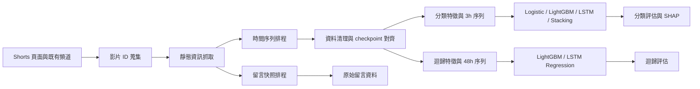

# YouTube 影片早期成長與爆紅預測

> 資料探勘導論期末專題報告底稿
> 最新模型流程執行日期：2026-06-02
> 本文件可直接作為報告基底，再依課程格式補上組員、課程資訊與分工。

## 摘要

本專題建立一套持續運作的 YouTube 影片資料蒐集與預測流程，目標是在影片發布初期，根據觀看數、互動數、頻道規模與影片靜態資訊，預測影片後續是否會爆紅，並估計未來觀看成長量。

系統透過自製爬蟲持續收集影片靜態資料、觀看數時間序列與留言快照。本次報告使用 2026-06-02 11:23（Asia/Taipei）重新執行 preprocessing 所產生的固定快照。該快照包含 162,396 筆清理後時間序列觀測，涵蓋 11,105 部影片。其中，1,222 部影片同時具備接近發布後 3 小時與 48 小時的有效觀測，可用於爆紅分類；1,420 部影片同時具備接近 48 小時與 72 小時的有效觀測，可用於觀看成長迴歸。

分類任務比較 Logistic Regression、LightGBM、LSTM 與 Stacking Ensemble。測試集結果顯示，LightGBM 表現最佳，F1-score 為 0.5882、AUC-ROC 為 0.9398、PR-AUC 為 0.7992。迴歸任務比較 LightGBM 與 LSTM，LightGBM 同樣較佳，在 `log1p(next_24h_views)` 目標上取得測試集 R² 0.7667。SHAP 分析顯示，發布後 1 至 3 小時的觀看增量，以及頻道訂閱數，是爆紅預測最重要的兩項特徵。

本次結果說明，早期成長速度對後續爆紅具有明顯預測力；相較於序列模型，結構化特徵搭配 LightGBM 在目前資料規模與資料品質下更穩定。系統已切換為 Shorts-only 蒐集模式，以增加 Shorts 樣本，但新的 Shorts 尚需累積至少 48 小時才能進入分類資料集，因此目前結果仍應視為階段性基準。

## 1. 研究背景與動機

YouTube 影片的觀看成長具有高度不均衡與長尾特性。多數影片觀看量有限，少數影片則可能在發布後快速擴散。若能在發布初期預測後續表現，可協助創作者、內容平台或行銷人員提早辨識具有潛力的影片。

本專題聚焦兩個問題：

1. 能否使用影片發布後前 3 小時的資料，預測影片在 48 小時內是否爆紅？
2. 能否使用影片發布後前 48 小時的資料，預測接下來 24 小時的新增觀看數？

此外，專題也希望比較傳統機器學習與深度學習序列模型的表現，確認在目前資料規模下，複雜模型是否真的帶來改善。

## 2. 系統架構



系統包含四個主要模組：

| 模組 | 功能 |
|---|---|
| 爬蟲排程 | 持續發現影片、抓取靜態資訊、定期記錄觀看與互動數 |
| 原始資料儲存 | 使用 JSON、CSV、JSONL 與 SQLite 保存影片、時間序列、留言與排程狀態 |
| 前處理流程 | 清理時間序列、對齊 checkpoint、建立分類與迴歸特徵 |
| 模型與評估 | 訓練分類、迴歸、序列與 ensemble 模型，輸出指標與 SHAP 排名 |

## 3. 資料蒐集

### 3.1 蒐集內容

系統目前蒐集三類資料：

| 資料類型 | 主要欄位 |
|---|---|
| 影片靜態資訊 | `video_id`、標題、發布時間、影片長度、分類、標籤數、是否為 Shorts、頻道 ID |
| 時間序列 | 抓取時間、發布後經過分鐘數、觀看數、按讚數、留言數、訂閱數、影片狀態 |
| 留言快照 | 影片 ID、快照時間點、留言 ID、留言文字、留言按讚數、留言發布時間 |

留言快照目前已完成蒐集，但尚未加入本次模型特徵。現階段模型使用的是影片靜態資訊與觀看、按讚、留言數量等結構化欄位。

### 3.2 爬蟲即時狀態

爬蟲在模型訓練期間仍持續運作，未曾停止。以下為撰寫報告時的即時狀態，因此數字會繼續增加：

| 項目 | 數量 |
|---|---:|
| 已發現影片 | 36,266 |
| 已取得靜態資訊 | 19,846 |
| 尚待處理 static queue | 692 |
| 已標記為過期、略過的 Shorts pending | 15,692 |
| 頻道數 | 10,304 |
| 爬蟲錯誤紀錄 | 3,154 |

影片來源分布如下：

| 來源 | 數量 |
|---|---:|
| Shorts page | 31,503 |
| Explore | 2,737 |
| Fresh search | 1,515 |
| Channel | 280 |
| Search | 231 |

先前 Shorts 樣本不足，因此目前蒐集策略已改為 Shorts-only。為避免新 Shorts 在 queue 中等待過久、錯過 3 小時 checkpoint，排程器會優先處理最新影片，並略過等待超過 3 小時的 pending Shorts。

### 3.3 固定 preprocessing 快照

模型訓練使用 2026-06-02 11:23（Asia/Taipei）產生的 processed 快照，而非隨時變動的 raw 資料。

| 階段 | 數量 |
|---|---:|
| 原始時間序列 | 171,541 筆，涵蓋 12,873 部影片 |
| 清理後時間序列 | 162,396 筆，涵蓋 11,105 部影片 |
| Tabular feature rows | 19,767 |
| 可建立 3h LSTM 序列 | 7,026 |
| 可建立 48h LSTM 序列 | 8,675 |
| 有留言快照的影片 | 1,886 |
| 留言紀錄 | 38,918 |
| 分類可用樣本 | 1,222 |
| 迴歸可用樣本 | 1,420 |

分類樣本數遠少於已發現影片數，主要原因是分類資料必須同時命中接近發布後 3 小時與 48 小時的 checkpoint。YouTube 無法回補歷史觀看數，因此若影片進入排程時已經太晚，就無法補出早期觀測。

## 4. 資料前處理

### 4.1 時間序列清理

時間序列清理流程如下：

1. 將抓取時間統一轉為 UTC datetime。
2. 依靜態資料中的發布時間重新計算 `time_since_publish_minutes`。
3. 移除 `UNPLAYABLE`、`LOGIN_REQUIRED` 等非正常狀態的觀測。
4. 將觀看數、按讚數、留言數與訂閱數轉為數值。
5. 對同一影片、同一分鐘的重複 snapshot 去重，保留觀看數較高者。
6. 對發布後前 3 小時內的缺值進行線性插值。

本次清理後由 171,541 筆原始觀測保留 162,396 筆有效觀測。

### 4.2 Checkpoint 規則

模型需要擷取最接近目標時間點的 snapshot。若 snapshot 與目標時間差超過容許範圍，該 checkpoint 視為缺失。

| Checkpoint | 容許誤差 |
|---|---:|
| 0h | ±15 分鐘 |
| 1h | ±15 分鐘 |
| 3h | ±20 分鐘 |
| 48h | ±90 分鐘 |
| 72h | ±120 分鐘 |

### 4.3 爆紅標籤

分類目標為 `is_viral_48h`。實作規則如下：

```text
effective_subscriber_count = max(subscriber_count_at_publish, 1000)
min_abs_views_48h = 1000 if is_shorts else 200
viral_threshold_48h = max(min_abs_views_48h, 0.5 * effective_subscriber_count)
is_viral_48h = 1 if views_48h >= viral_threshold_48h else 0
```

此定義同時考量絕對觀看量與頻道規模，避免大型頻道僅因訂閱基數較高就被判定為爆紅，也避免小型頻道只靠極低基數造成比例失真。

另建立四級描述性標籤：

| 等級 | 條件概念 |
|---|---|
| `non_viral` | 未達主要比例條件 |
| `strong` | 48h 觀看量至少約為有效訂閱數 1 倍 |
| `viral` | 48h 觀看量至少約為有效訂閱數 2 倍，且通過絕對觀看門檻 |
| `super_viral` | 48h 觀看量至少約為有效訂閱數 5 倍，且通過絕對觀看門檻 |

### 4.4 迴歸目標

迴歸任務使用影片發布後 0 至 48 小時的資料，預測 48 至 72 小時之間的新增觀看數：

```text
next_24h_views = max(views_72h - views_48h, 0)
log_next_24h_views = log1p(next_24h_views)
```

由於觀看數呈現明顯長尾分布，模型實際預測 `log_next_24h_views`，降低極端熱門影片對訓練的影響。

## 5. 特徵工程

### 5.1 分類 Tabular Features

分類模型使用發布後前 3 小時內可得的資訊：

| 特徵群組 | 特徵 |
|---|---|
| 靜態資訊 | 影片長度、發布小時、是否 Shorts、標題長度、標籤數 |
| 頻道規模 | `log_subscriber_count` |
| 初期互動 | 1h / 3h 觀看數、3h 按讚數、3h 留言數 |
| 成長速度 | 0h 至 1h 觀看增量、1h 至 3h 觀看增量、早期成長率、每分鐘觀看數 |
| 互動比例 | 按讚觀看比、留言觀看比、早期 engagement rate |
| Log 特徵 | 3h 觀看、按讚、留言數的 `log1p` |

### 5.2 分類 LSTM Sequence

LSTM 分類模型使用發布後 0 至 3 小時內的序列：

```text
[view_count, like_count, comment_count]
```

每支影片的每個欄位分別依該影片時間窗內最大值正規化至 `[0, 1]`。模型架構為兩層 LSTM、hidden size 64、dropout 0.3，最後接線性輸出層。

### 5.3 迴歸特徵

LightGBM 迴歸模型使用 0 至 48 小時內的靜態與成長資訊，包括：

- 1h、3h、24h、48h 觀看數與其 `log1p`。
- 不同時間區間的新增觀看量。
- 晚期與早期增長比。
- 48h 按讚數、留言數與互動比例。
- 影片長度、發布時間、標籤數、頻道規模與 Shorts 標記。

LSTM 迴歸模型則使用 0 至 48 小時序列，並額外加入該時間窗最大觀看數的 `log1p` 作為每個 time step 的附加欄位。

## 6. 實驗設計

### 6.1 Temporal Split

為避免未來資料洩漏至訓練集，所有資料依發布時間排序後切分：

| Split | 比例 |
|---|---:|
| Train | 70% |
| Validation | 15% |
| Test | 15% |

分類資料切分如下：

| Split | 樣本數 | Viral 數 | Viral 比例 | 發布時間範圍（UTC） |
|---|---:|---:|---:|---|
| Train | 855 | 109 | 12.75% | 2026-05-08 至 2026-05-17 |
| Validation | 183 | 15 | 8.20% | 2026-05-17 至 2026-05-29 |
| Test | 184 | 21 | 11.41% | 2026-05-29 至 2026-05-31 |

迴歸資料切分如下：

| Split | 樣本數 | 發布時間範圍（UTC） |
|---|---:|---|
| Train | 993 | 2026-05-06 至 2026-05-16 |
| Validation | 213 | 2026-05-16 至 2026-05-23 |
| Test | 214 | 2026-05-23 至 2026-05-30 |

### 6.2 分類資料分布

| 項目 | 數量 |
|---|---:|
| 分類樣本總數 | 1,222 |
| Viral 樣本 | 145 |
| Viral 比例 | 11.87% |
| Shorts 樣本 | 100 |
| Shorts 比例 | 8.18% |

四級標籤分布：

| 等級 | 數量 |
|---|---:|
| `non_viral` | 1,137 |
| `strong` | 33 |
| `viral` | 28 |
| `super_viral` | 24 |

目前分類資料仍以先前蒐集的一般影片為主。雖然爬蟲已切換為 Shorts-only，但新 Shorts 必須等待 48 小時才能形成分類標籤，因此尚未大量進入本次 fixed snapshot。

### 6.3 模型

| 任務 | 模型 |
|---|---|
| 爆紅分類 | Logistic Regression、LightGBM、LSTM、Stacking Ensemble |
| 新增觀看迴歸 | LightGBM Regression、LSTM Regression |

Stacking Ensemble 使用 LightGBM 與 LSTM 的 out-of-fold 預測作為 Level-1 特徵，再以 Logistic Regression 作為 meta-learner。

## 7. 實驗結果

### 7.1 分類結果

以下為 test set 結果：

| 模型 | F1-score | Precision | Recall | AUC-ROC | PR-AUC | Threshold |
|---|---:|---:|---:|---:|---:|---:|
| Logistic Regression | 0.4043 | 0.2603 | **0.9048** | 0.9106 | 0.7748 | 0.5000 |
| **LightGBM** | **0.5882** | **0.5000** | 0.7143 | **0.9398** | **0.7992** | 0.5839 |
| LSTM | 0.0000 | 0.0000 | 0.0000 | 0.5907 | 0.1358 | 0.5176 |
| Stacking Ensemble | 0.5000 | 0.3721 | 0.7619 | 0.9384 | 0.7935 | 0.6199 |

LightGBM 在 F1-score、AUC-ROC 與 PR-AUC 上皆為最佳，因此是目前最適合的主模型。Logistic Regression 的 recall 最高，可找回 90.48% viral 影片，但誤報較多。Stacking Ensemble 沒有超越 LightGBM，主要原因是 LSTM 分類器在本次資料上的訊號較弱。

### 7.2 分類混淆矩陣

| 模型 | True Negative | False Positive | False Negative | True Positive |
|---|---:|---:|---:|---:|
| Logistic Regression | 109 | 54 | 2 | 19 |
| **LightGBM** | **148** | **15** | **6** | **15** |
| LSTM | 139 | 24 | 21 | 0 |
| Stacking Ensemble | 136 | 27 | 5 | 16 |

若實際應用重視降低誤報，建議使用 LightGBM。若應用重視盡可能不漏掉潛在熱門影片，可考慮 Logistic Regression 或調低 LightGBM threshold，再透過人工審核處理候選名單。

### 7.3 迴歸結果

以下指標均在模型實際預測目標 `log1p(next_24h_views)` 上計算：

| 模型 | Split | MAE | RMSE | RMSLE | R² | 樣本數 |
|---|---|---:|---:|---:|---:|---:|
| **LightGBM Regression** | Validation | **0.7886** | **1.1126** | **0.3385** | **0.8586** | 213 |
| **LightGBM Regression** | Test | **1.0218** | **1.4050** | **0.4211** | **0.7667** | 214 |
| LSTM Regression | Validation | 0.9294 | 1.2706 | 0.3692 | 0.8052 | 206 |
| LSTM Regression | Test | 1.2455 | 1.5744 | 0.4901 | 0.7015 | 208 |

LightGBM Regression 的 test R² 為 0.7667，優於 LSTM Regression 的 0.7015。在轉回原始觀看數尺度後，LightGBM test MAE 約為 3,926 views，RMSE 約為 42,267 views。RMSE 明顯偏高，反映少數極端熱門影片仍會造成大誤差。

整體迴歸目標呈現高度長尾：

| 統計量 | `next_24h_views` |
|---|---:|
| Median | 94.5 |
| Mean | 4,999.5 |
| 90th percentile | 5,600 |
| Maximum | 630,076 |

## 8. SHAP 特徵重要性

LightGBM 分類模型的前 10 名 SHAP 特徵如下：

| 排名 | 特徵 | Mean Absolute SHAP |
|---:|---|---:|
| 1 | `view_delta_1h_3h` | 0.7265 |
| 2 | `log_subscriber_count` | 0.6864 |
| 3 | `title_length` | 0.1949 |
| 4 | `duration_seconds` | 0.1769 |
| 5 | `publish_hour` | 0.1643 |
| 6 | `views_3h` | 0.1289 |
| 7 | `view_delta_0h_1h` | 0.0830 |
| 8 | `log_views_3h` | 0.0665 |
| 9 | `views_per_minute_early` | 0.0622 |
| 10 | `view_growth_rate_1h` | 0.0552 |

最重要的特徵是 `view_delta_1h_3h`，顯示影片發布後 1 至 3 小時是否持續加速，是預測 48 小時爆紅的重要訊號。`log_subscriber_count` 排名第二，表示頻道基礎受眾仍然具有影響力。其餘重要特徵則包含標題長度、影片長度、發布時間與 3 小時累積觀看數。

## 9. 結果討論

### 9.1 為何 LightGBM 表現較佳

目前資料量仍屬中小型，且分類目標具有不平衡問題。LightGBM 能有效利用觀看增量、訂閱數、互動率等人工設計特徵，對資料規模的需求也較低，因此在本次實驗中優於 LSTM。

### 9.2 為何 LSTM 分類表現不佳

LSTM 分類器在 test set 的 AUC-ROC 為 0.5907，代表仍有些微排序能力，但依 validation set 選定 threshold 後，沒有成功預測任何正類。可能原因包括：

1. Viral 樣本僅 145 部，序列模型可學習的正類案例不足。
2. 每部影片的 snapshot 密度與時間間距不完全一致。
3. 每個序列各自以最大值正規化，削弱了絕對觀看規模訊號。迴歸 LSTM 已透過附加 `log1p(max_views)` 作為第 4 維特徵修正此問題；分類 LSTM 尚未加入此修正。
4. Tabular 模型能直接使用訂閱數、標題長度、發布時間等重要特徵，LSTM 分類器目前只看到觀看、按讚與留言序列。

### 9.3 為何 Stacking 沒有改善

Stacking Ensemble 的 test AUC-ROC 為 0.9384，與 LightGBM 接近，但 F1-score 降至 0.5000。由於 LSTM 訊號較弱，meta-learner 沒有得到足夠互補資訊。現階段直接使用 LightGBM 較簡潔且穩定。

### 9.4 Shorts-only 蒐集策略的影響

目前爬蟲已切換為 Shorts-only，以補足過去 Shorts 樣本不足的問題。但本次分類資料中 Shorts 僅占 8.18%，因為新的 Shorts 至少需要等待 48 小時才能形成標籤。

因此，本次報告可以支持「早期特徵可預測後續爆紅」的結論，但尚不足以對 Shorts-only 場景做最終結論。未來應在累積更多完整 Shorts 樣本後，重新訓練並比較模型表現。

## 10. 限制

本專題目前仍有以下限制：

1. **Shorts 樣本仍不足。** 最新爬蟲策略已改善蒐集方向，但新樣本尚未成熟。
2. **Checkpoint 可能缺失。** 若爬蟲過晚發現影片，無法回補 3h 或 48h 的歷史觀看數。
3. **留言文字尚未建模。** 已收集 38,918 筆留言紀錄，但 sentiment 與 emotion 特徵尚未加入模型。
4. **資料仍在持續成長。** 本報告採 fixed processed snapshot；重新 preprocessing 後數字會改變。
5. **分類不平衡。** Viral 僅占 11.87%，F1-score 與 PR-AUC 比 accuracy 更具參考價值。
6. **迴歸長尾嚴重。** 少數極熱門影片會顯著提高原始觀看數尺度上的 RMSE。
7. **LSTM 訓練仍可進一步調校。** 訓練使用 GPU 加速（CUDA 12.8，torch 2.11.0+cu128），但尚未做完整超參數搜尋與多次隨機種子實驗。
8. **`RMSLE` 欄位需謹慎解讀。** 目前 evaluator 對已經過 `log1p` 的迴歸目標再次計算 log-based error，因此報告應優先引用 MAE、RMSE 與 R²，並註明皆位於 log target 尺度。

## 11. 結論

本專題完成一套可持續運作的 YouTube 影片資料蒐集、前處理、模型訓練與評估流程。實驗顯示：

1. 使用發布後前 3 小時的資料，能有效預測影片 48 小時內是否爆紅。
2. LightGBM 是目前最佳分類模型，test F1-score 為 0.5882，AUC-ROC 為 0.9398，PR-AUC 為 0.7992。
3. 發布後 1 至 3 小時的觀看增量，是最重要的爆紅預測特徵。
4. LightGBM Regression 能以 0 至 48 小時資料預測接下來 24 小時增長，在 log target 上取得 test R² 0.7667。
5. 在目前資料量下，結構化特徵搭配 LightGBM 比 LSTM 更穩定；Stacking 也尚未超越單一 LightGBM。

若作為實際系統部署，建議先採用 LightGBM 作為主要模型，持續透過 Shorts-only 爬蟲累積完整樣本，再加入留言情緒特徵並重新評估。

## 12. 後續工作

可延伸方向如下：

1. 累積更多完整 Shorts 3h / 48h / 72h checkpoint。
2. 將留言文字轉換為 sentiment、valence-arousal 或 embedding 特徵。
3. 針對 Shorts 與一般影片分別建立模型，再比較是否需要不同 threshold。
4. 對 LSTM 加入頻道規模、影片長度與發布時間等靜態特徵。
5. 對分類 LSTM 加入絕對觀看規模訊號（如 `log1p(max_views)`），與迴歸 LSTM 現行做法一致。
6. 對不同 threshold 進行 precision-recall trade-off 分析。
7. 增加 repeated runs 與不同 random seed，檢查結果穩定性。

## 13. 可直接放入簡報的重點

### 問題

- 能否在影片發布後 3 小時內，預測 48 小時後是否爆紅？
- 能否用前 48 小時資料，預測接下來 24 小時觀看成長？

### 資料

- 162,396 筆清理後時間序列。
- 1,222 筆分類樣本，viral 比例 11.87%。
- 1,420 筆迴歸樣本。
- 爬蟲持續運作，並已切換 Shorts-only。

### 最佳結果

- 分類：LightGBM，F1 = 0.5882，AUC-ROC = 0.9398。
- 迴歸：LightGBM，R² = 0.7667。
- 最重要特徵：發布後 1 至 3 小時觀看增量。

### 核心結論

影片是否爆紅，不只取決於最初觀看量，更重要的是發布後數小時內是否持續加速。

## 14. 參考資料

1. Ke, G. et al. (2017). [LightGBM: A Highly Efficient Gradient Boosting Decision Tree](https://proceedings.neurips.cc/paper_files/paper/2017/hash/6449f44a102fde848669bdd9eb6b76fa-Abstract.html). *Advances in Neural Information Processing Systems 30*.
2. Hochreiter, S. and Schmidhuber, J. (1997). [Long Short-Term Memory](https://doi.org/10.1162/neco.1997.9.8.1735). *Neural Computation*, 9(8), 1735-1780.
3. Lundberg, S. M. and Lee, S.-I. (2017). [A Unified Approach to Interpreting Model Predictions](https://proceedings.neurips.cc/paper_files/paper/2017/hash/8a20a8621978632d76c43dfd28b67767-Abstract.html). *Advances in Neural Information Processing Systems 30*.
4. Pedregosa, F. et al. (2011). [Scikit-learn: Machine Learning in Python](https://www.jmlr.org/papers/v12/pedregosa11a.html). *Journal of Machine Learning Research*, 12, 2825-2830.

## 附錄 A：輸出檔案

| 檔案 | 說明 |
|---|---|
| `data/processed/label_dataset.csv` | 分類標籤 |
| `data/processed/tabular_features.csv` | 分類 tabular features |
| `data/processed/regression_dataset.csv` | 迴歸目標 |
| `data/processed/regression_features_48h.csv` | 迴歸 features |
| `results/metrics.csv` | 分類評估指標 |
| `results/regression_metrics.csv` | 迴歸評估指標 |
| `results/feature_importance_shap.csv` | SHAP 特徵重要性 |
| `results/report_snapshot.json` | 本報告使用的統計快照 |
| `models/lightgbm_classifier.pkl` | 最佳分類模型 |
| `models/lightgbm_regressor.pkl` | 最佳迴歸模型 |

## 附錄 B：重現流程

```powershell
python -m src.preprocessing.run_all
python -m src.modeling.train_logistic
python -m src.modeling.train_lightgbm
python -m src.modeling.train_regression
python -m src.modeling.train_lstm --task classification
python -m src.modeling.train_lstm --task regression
python -m src.modeling.train_stacking
python -m src.modeling.shap_analysis
```

本次執行前，系統額外安裝：

```powershell
python -m pip install torch shap
```
