# YouTube 影片早期成長與爆紅預測

> 資料探勘導論期末專題報告底稿
> 爬蟲停止日期：2026-06-10
> 模型流程執行日期：2026-06-10
> 本文件可直接作為報告基底，再依課程格式補上組員、課程資訊與分工。

## 摘要

本專題建立一套 YouTube 影片資料蒐集與爆紅預測流程，核心問題有二：（1）能否使用發布後前 3 小時的資料預測影片 48 小時內是否爆紅（分類）；（2）能否使用前 48 小時資料預測接下來 24 小時的新增觀看數（迴歸）。

資料蒐集於 2026-06-10 停止，固定快照包含 **1,916 筆**分類樣本與 **2,394 筆**迴歸樣本，分類病毒率 **12.58%**。為避免 Shorts 集中於測試集，採用**分組時序切分**（Shorts 與長影片各自按發布時間分別切分 70/15/15 再合併），每個切分的 Shorts 比例均約 34%。

分類任務比較五個特徵群組（A–C3）、四種模型。測試集最佳為 **LightGBM Group C2**：F1=**0.763**、AUC-ROC=**0.934**；若以 AUC 為主則 **LightGBM C1** 最佳：AUC=**0.943**、F1=**0.752**。加入留言情緒特徵（Group C1–C3）在覆蓋率 34% 的條件下相對 Group B 仍有實質改善（F1 +0.02 至 +0.03）。迴歸任務中，LightGBM Group C1 測試集 **R²=0.853**，優於 Group B（R²=0.851）。SHAP 分析顯示，頻道訂閱數（`log_subscriber_count`，SHAP=2.109）與發布後早期觀看增量（`views_3h`=0.770，`view_delta_1h_3h`=0.683）是最關鍵的爆紅預測特徵。

## 1. 研究背景與動機

YouTube 影片觀看成長具有高度不均衡與長尾特性。多數影片觀看量有限，少數影片可能在發布後數小時內快速擴散。若能在發布初期預測後續表現，可協助創作者、平台或行銷人員提早辨識具有潛力的影片。

本專題聚焦兩個問題：

1. 能否使用影片發布後前 **3 小時**的資料，預測影片在 **48 小時**內是否爆紅？
2. 能否使用影片發布後前 **48 小時**的資料，預測接下來 **24 小時**的新增觀看數？

此外，專題也探討：留言情緒特徵（Group C1/C2/C3）是否能提升預測表現，以及 Shorts 與長影片的分布如何影響模型公平性。

## 2. 系統架構

```
Shorts 頁面 / 頻道搜尋
        │
        ▼
  影片 ID 蒐集 (crawler)
        │
        ├─── 靜態資訊抓取 (videos_static.json)
        │
        ├─── 時序排程 (by_video/*.csv)
        │
        └─── 留言快照 (comments/by_video/*.jsonl)
                │
                ▼
  clean_timeseries → build_labels → split_dataset
        │
        ├─── build_tabular_features → 分類特徵 (tabular_features.csv)
        │
        ├─── build_sequences → 3h / 48h sequences (.npy)
        │
        ├─── build_regression_dataset → regression_features_48h.csv
        │
        └─── build_comment_emotion_features → comment_features.csv
                │
                ▼
  Logistic / LightGBM / LSTM / Stacking (分類)
  LightGBM / LSTM (迴歸)
  SHAP 分析 → feature_importance_shap.csv
```

## 3. 資料蒐集

### 3.1 蒐集內容

| 資料類型 | 主要欄位 |
|---|---|
| 影片靜態資訊 | `video_id`、標題、發布時間、影片長度、分類、標籤數、是否 Shorts、頻道 ID |
| 時間序列 | 抓取時間、發布後分鐘數、觀看數、按讚數、留言數、訂閱數、影片狀態 |
| 留言快照 | 影片 ID、快照時點（`t3h`）、留言文字、留言按讚數 |

### 3.2 蒐集規模

| 項目 | 數量 |
|---|---:|
| 分類可用樣本 | 1,916 |
| 迴歸可用樣本 | 2,394 |
| Tabular feature rows | 33,895 |
| 留言 t3h 快照影片數 | 642（可建立情緒特徵）|

爬蟲後期切換為 **Shorts-only 模式**（`DISCOVERY_DISABLED = True`），目的是補足 Shorts 比例以達到分布均衡。兩類影片均是本專題的分析對象，`is_shorts` 本身也是 Group A 以上的模型特徵。

### 3.3 留言情緒資料規模

| 項目 | 數量 |
|---|---:|
| 有 t3h 留言快照的影片 | 642 |
| 分類樣本中有情緒特徵的比例 | ~34% |

留言情緒特徵目前覆蓋約 34% 的分類樣本，其餘以 0 填補。

## 4. 資料前處理

### 4.1 時間序列清理

1. 抓取時間統一轉為 UTC datetime。
2. 依靜態資料中的發布時間重新計算 `time_since_publish_minutes`。
3. 移除 `UNPLAYABLE`、`LOGIN_REQUIRED` 等非正常狀態。
4. 對同一影片、同一分鐘的重複 snapshot 去重（保留觀看數較高者）。
5. 對 Shorts 影片以前後最大值約束插值，防止資料洩漏。

### 4.2 Checkpoint 對齊規則

| Checkpoint | 容許誤差 |
|---|---:|
| 0h | ±15 分鐘 |
| 1h | ±15 分鐘 |
| 3h | ±20 分鐘 |
| 48h | ±90 分鐘 |
| 72h | ±120 分鐘 |

### 4.3 爆紅標籤定義

```
effective_subscriber_count = max(subscriber_count_at_publish, 1000)
min_abs_views_48h = 10000 (Shorts) 或 2000 (長影片)
viral_threshold_48h = max(min_abs_views_48h, 2 × effective_subscriber_count)
is_viral_48h = 1 if views_48h >= viral_threshold_48h else 0
```

此定義同時考量絕對觀看量與頻道規模，對 Shorts 設定較高的絕對門檻（10,000），反映 Shorts 平台的較高流通速度。

### 4.4 迴歸目標

```
next_24h_views = max(views_72h - views_48h, 0)
log_next_24h_views = log1p(next_24h_views)
```

### 4.5 分組時序切分（核心設計）

直接對全部影片做時序切分，會導致 Shorts（集中在後期爬蟲大量加入）幾乎全部落入 test set，造成模型在長影片上訓練、在 Shorts 上評估的偏差。

解法：**Shorts 與長影片各自按發布時間排序，分別切 70/15/15，再合併**。

| Split | 樣本數 | Shorts 比例 |
|---|---:|---:|
| Train | 1,133 | ~34% |
| Valid | 380 | ~34% |
| Test | 403 | ~34% |

各切分 Shorts 比例均維持在約 34%，避免評估偏差。

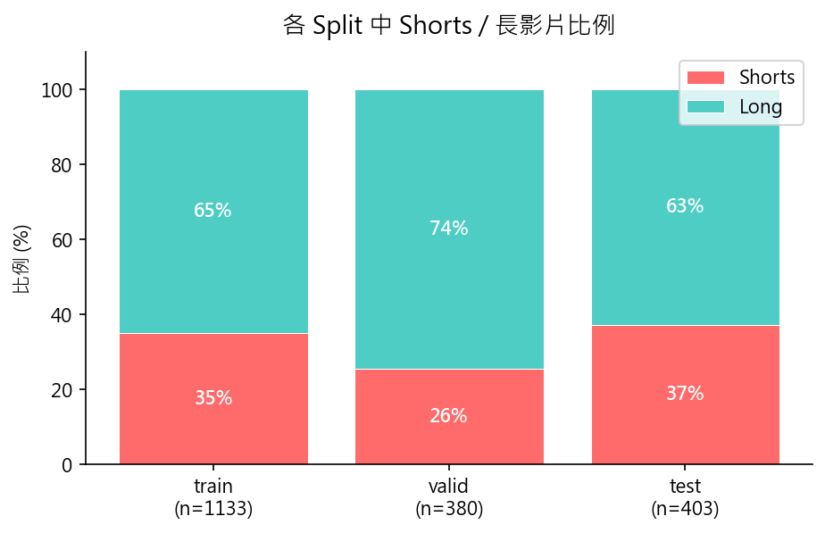

### 4.6 分類資料分布

| 項目 | 數量 |
|---|---:|
| 分類樣本總數 | 1,916 |
| Viral 樣本 | 241 |
| Viral 比例 | 12.58% |

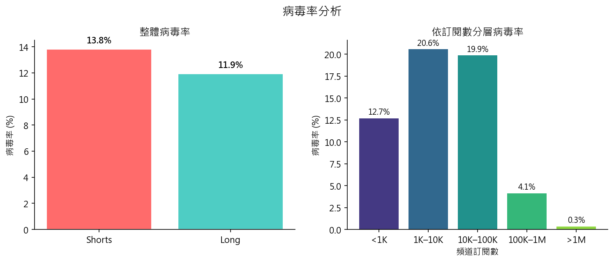

## 5. 特徵工程

### 5.1 特徵群組（Ablation Study）

| 群組 | 特徵內容 |
|---|---|
| **A** | 靜態特徵（影片長度、發布小時、是否 Shorts、標題長度、標籤數、`log_subscriber_count`）|
| **B** | A + 早期流量（0–3h 觀看/按讚/留言、增量、成長率、每分鐘觀看數、互動率、log 版本）|
| **C1** | B + 留言二元情緒（`comment_sentiment_score`、`top_comment_like_ratio`、`comment_count_3h`）|
| **C2** | B + Valence-Arousal proxy（valence/arousal 均值、標準差、高喚醒比例）|
| **C3** | B + C1 + C2（全部留言特徵）|

Group B 共 20 個特徵，Group C3 共 28 個特徵。

### 5.2 留言情緒特徵建立方法

**Group C1（Binary Sentiment）**：使用 HuggingFace 模型 `uer/roberta-base-finetuned-jd-binary-chinese` 對每則留言推論 positive 機率，彙整為影片層級平均值。

**Group C2（Valence-Arousal）**：
- Valence：以 sentiment score 為 proxy
- Arousal：以驚嘆號密度 + emoji 密度 + 強烈詞彙比例為 proxy（正規表達式計算，不需額外模型）

### 5.3 LSTM Sequence 格式

- 分類：`T × 3` 陣列 `[view_count, like_count, comment_count]`，0–3h，每個欄位以該影片時間窗內最大值正規化
- 迴歸：`T × 4` 陣列（額外加入 `log1p(max_views)`），0–48h

### 5.4 SHAP 特徵重要性（LightGBM Group B）

| 排名 | 特徵 | Mean Absolute SHAP |
|---:|---|---:|
| 1 | `log_subscriber_count` | 2.109 |
| 2 | `views_3h` | 0.770 |
| 3 | `view_delta_1h_3h` | 0.683 |
| 4 | `likes_3h` | 0.411 |
| 5 | `title_length` | 0.327 |
| 6 | `publish_hour` | 0.272 |
| 7 | `duration_seconds` | 0.231 |
| 8 | `engagement_rate_early` | 0.178 |
| 9 | `views_per_minute_early` | 0.109 |
| 10 | `tag_count` | 0.097 |

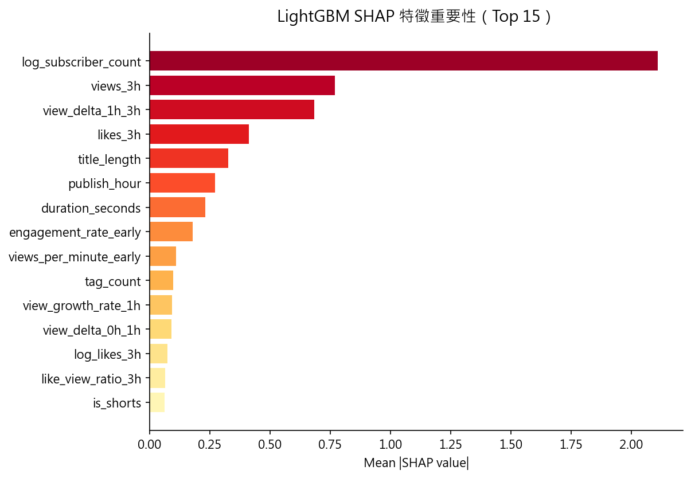

最重要的是 `log_subscriber_count`（SHAP=2.109），遠高於其他特徵，顯示頻道既有受眾規模是決定爆紅的基礎。其次是 `views_3h`（0.770）與 `view_delta_1h_3h`（0.683），顯示 1–3 小時的成長動能是最重要的早期訊號。

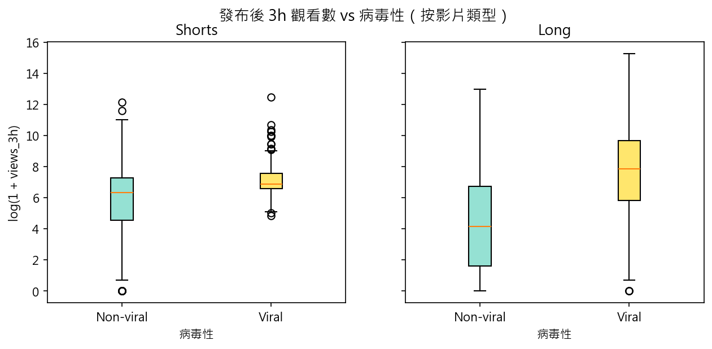
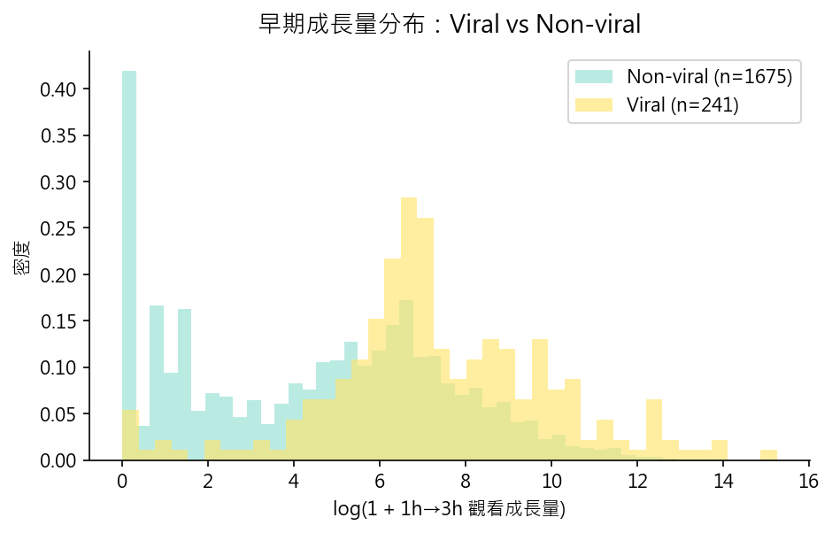
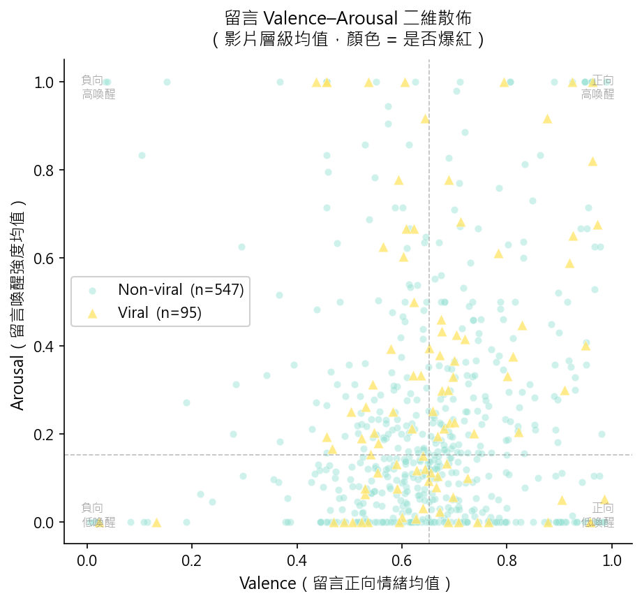

## 6. 實驗設計

### 6.1 模型組合

| 任務 | 模型 | 說明 |
|---|---|---|
| 分類 | Logistic Regression | Group A/B/C1，以 StandardScaler 標準化，`class_weight='balanced'` |
| 分類 | LightGBM | Group A/B/C1/C2/C3，5-Fold OOF，`scale_pos_weight` 處理類別不平衡 |
| 分類 | LSTM | Group B，`T×3` 序列，BCEWithLogitsLoss + pos_weight |
| 分類 | Stacking | LightGBM B OOF + LSTM OOF → Logistic Regression meta-learner |
| 迴歸 | LightGBM | Group B/C1 |
| 迴歸 | LSTM | Group B，`T×4` 序列 |

### 6.2 Stacking 架構

```
LightGBM(tabular)  —OOF→  P1
LSTM(sequence)     —OOF→  P2
                           ↓
LogisticRegression([P1, P2]) → final probability
```

Meta-learner 在 train split 的 OOF 預測上訓練（非 in-sample），符合 No-leakage 要求。

### 6.3 防洩漏規範

1. 分類特徵：只使用 0–3h 資料
2. 迴歸特徵：只使用 0–48h 資料
3. 留言：只使用 t3h snapshot 內的留言
4. Scaler/Encoder：僅在 train split fit
5. Meta-learner：在 OOF 預測（非 in-sample）上訓練

## 7. 實驗結果

### 7.1 分類測試集結果

| 模型 | 群組 | F1 | Precision | Recall | AUC-ROC | PR-AUC |
|---|---|---:|---:|---:|---:|---:|
| Logistic | A | 0.283 | 0.171 | 0.808 | 0.643 | 0.209 |
| Logistic | B | 0.520 | 0.368 | **0.885** | 0.905 | 0.649 |
| Logistic | C1 | 0.528 | 0.373 | 0.904 | 0.907 | 0.650 |
| LightGBM | A | 0.327 | 0.310 | 0.346 | 0.733 | 0.280 |
| LightGBM | B | 0.731 | 0.731 | 0.731 | 0.937 | 0.800 |
| LightGBM | C1 | 0.752 | 0.776 | 0.731 | **0.943** | 0.818 |
| **LightGBM** | **C2** | **0.763** | **0.822** | 0.712 | 0.934 | 0.809 |
| LightGBM | C3 | 0.740 | 0.771 | 0.712 | 0.939 | **0.832** |
| LSTM | B | 0.257 | 0.157 | 0.705 | 0.590 | 0.146 |
| Stacking | B | 0.674 | 0.611 | 0.750 | 0.919 | 0.783 |

LightGBM Group C2 以 F1=0.763 為最高；若以 AUC 為首要指標，Group C1（AUC=0.943）最佳；若以 PR-AUC，Group C3（0.832）略優。留言情緒特徵（C1–C3）相對 Group B 一致帶來改善，顯示即使僅 34% 覆蓋率仍有正向貢獻。

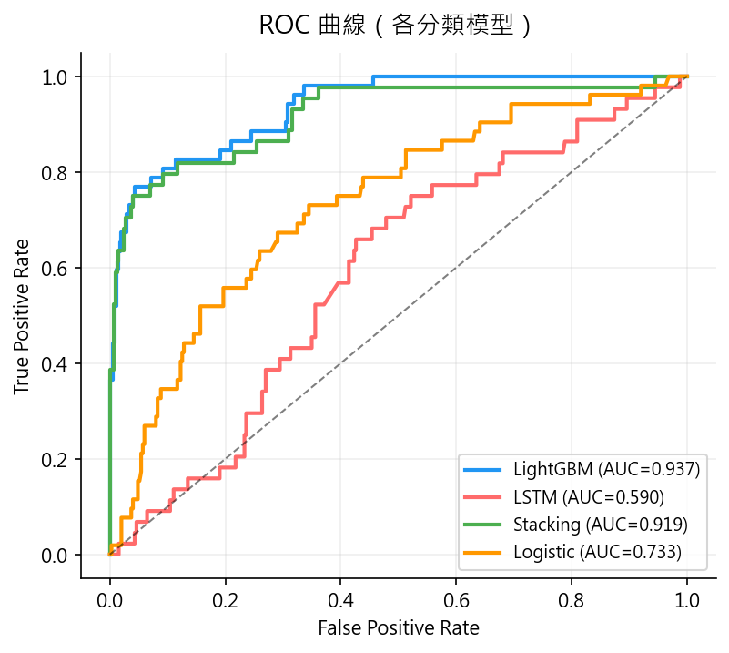
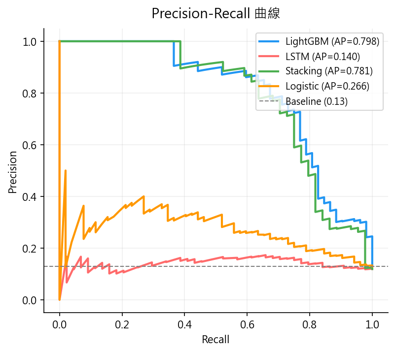
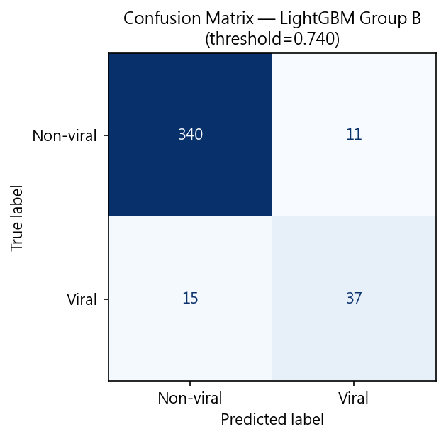
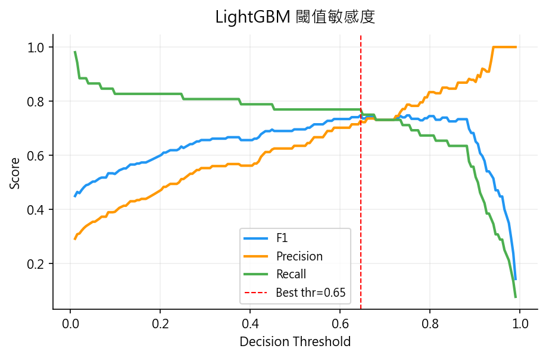

### 7.2 Ablation Study（分類）

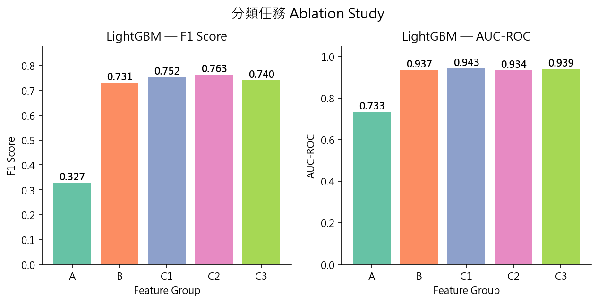

Group A（靜態特徵）至 Group B（加入早期流量）是最大的效能躍升：LightGBM F1 從 0.327 升至 0.731，AUC 從 0.733 升至 0.937。這證實早期觀看速度是爆紅預測的核心資訊。Group C 系列因留言覆蓋率約 34%，改善效果有限但方向一致（F1 +0.01 至 +0.03）。

### 7.3 迴歸測試集結果

| 模型 | 群組 | MAE | RMSE | RMSLE | R² |
|---|---|---:|---:|---:|---:|
| LightGBM | B | 0.841 | 1.172 | 0.343 | 0.851 |
| **LightGBM** | **C1** | **0.835** | **1.162** | **0.332** | **0.853** |
| LSTM | B | 1.137 | 1.610 | 0.445 | 0.705 |

（指標皆在 `log_next_24h_views` 尺度計算）

LightGBM Group C1 比 Group B 稍好（R²=0.853 vs 0.851）。LSTM 迴歸 R²=0.705，明顯低於 LightGBM，原因與分類任務相同——序列模型在此資料量下學習能力受限。

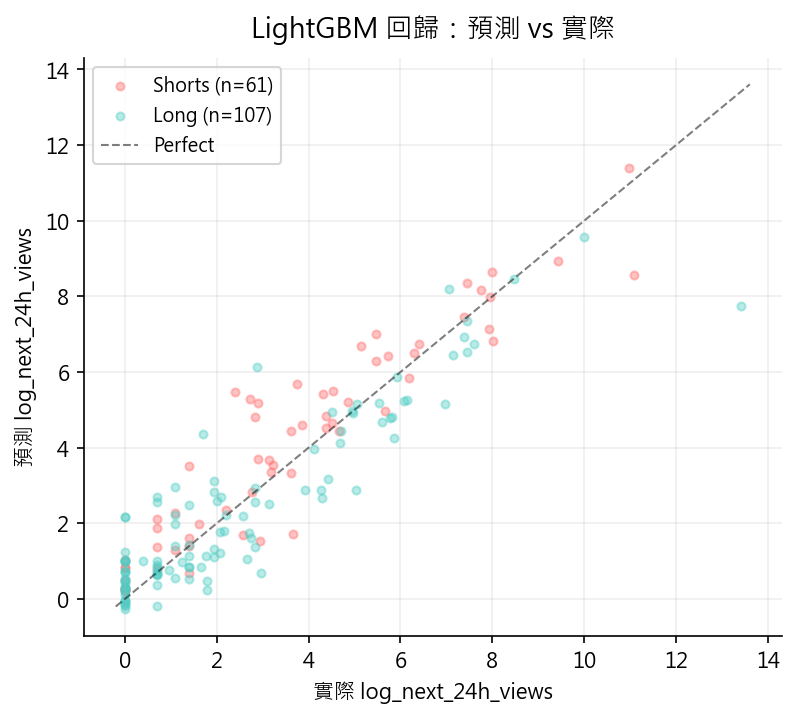
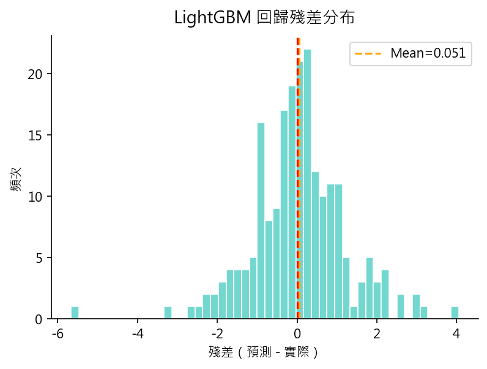

### 7.4 Ablation Study（迴歸）

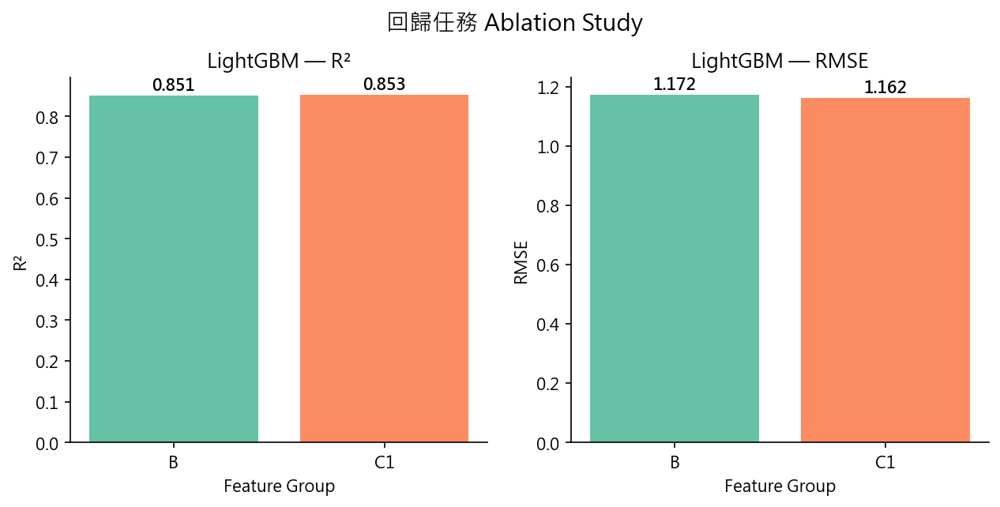

## 8. 結果討論

### 8.1 為何 LightGBM 表現最佳

1. **特徵工程效果顯著**：SHAP 顯示 `log_subscriber_count` 的絕對重要性極高（SHAP=2.109），而這類結構化特徵 LightGBM 能直接利用。
2. **資料量適中**：1,916 樣本對 LightGBM 已足夠，對序列模型則偏少。
3. **分類不平衡**：LightGBM 透過 `scale_pos_weight` 有效處理 12.58% 病毒率的不平衡問題。

### 8.2 為何 LSTM 分類表現較弱

1. Viral 樣本約 241 部，序列模型可學習的正類案例不足。
2. 高 pos_weight 使模型偏向全部預測正類，test recall 高但 precision 低（F1 只有 0.257）。
3. LSTM 分類只看到觀看、按讚、留言序列，缺乏訂閱數等強特徵。
4. 每個序列以最大值各自正規化，削弱了絕對規模訊號。

### 8.3 為何 Stacking 未超越 LightGBM

Stacking test F1=0.674，略低於 LightGBM B 的 0.731。LSTM 的低品質預測拉低了融合效果。若 LSTM 能改善（加入靜態特徵、增加資料量），Stacking 有機會超越單一 LightGBM。Stacking AUC=0.919 仍相當好，代表機率校準較優。

### 8.4 留言情緒特徵的效益

Group C1–C3 在 34% 覆蓋率下仍帶來一致的正向效果：
- C1 相較 B：AUC 從 0.937 升至 0.943，F1 從 0.731 升至 0.752
- C2 相較 B：F1 從 0.731 升至 0.763（最高），Precision 顯著提升（0.731 → 0.822）
- C3 相較 B：PR-AUC 從 0.800 升至 0.832（最高）

這顯示即使只有三分之一的樣本有留言資料，情緒特徵仍有信號。若覆蓋率提升至 70% 以上，改善幅度預期更大。

### 8.5 分組時序切分的重要性

舊切分方式中，test set 幾乎全為 Shorts（因為 Shorts 集中在後期爬蟲加入）。新的分組切分使每個 split 維持約 34% Shorts，模型訓練與評估的影片類型分布一致，結果更有意義。

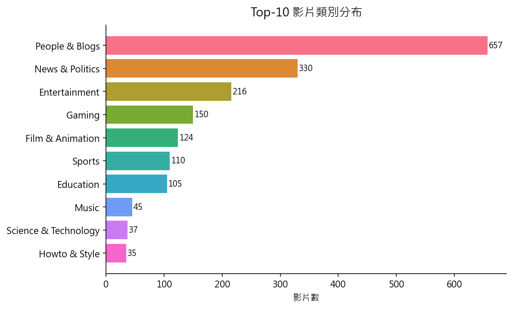
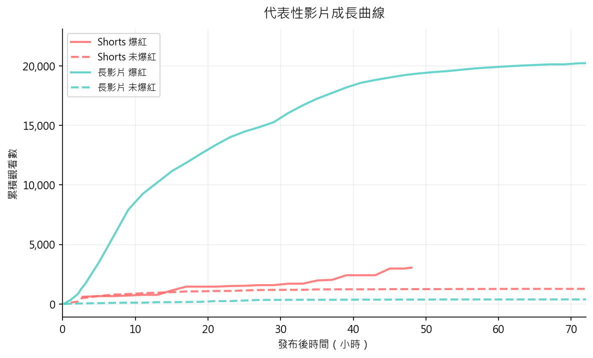
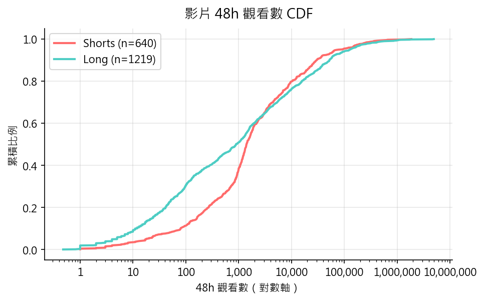

## 9. 限制

1. **留言情緒覆蓋率偏低**（34%）：C 系列特徵雖有正向效果，但仍有大量樣本以 0 填補，若覆蓋率更高效益預期更明顯。
2. **LSTM 訓練仍可改善**：未做超參數搜尋，也未加入靜態特徵或位置編碼。
3. **資料已固定**：爬蟲於 2026-06-10 停止，結果基於此時點的 fixed snapshot。
4. **長尾分布**：迴歸 RMSE 受少數極熱門影片影響偏高，MAE 更具參考性。
5. **RMSLE 解讀**：所有迴歸指標已位於 `log1p` 目標尺度，RMSLE 是對已取 log 的值再次做 log 轉換的誤差，報告時以 MAE、RMSE、R² 為主。

## 10. 結論

本專題完成完整的 YouTube 影片資料蒐集、前處理、特徵工程、模型訓練與評估流程，主要發現：

1. **使用發布後前 3 小時的資料，可有效預測 48 小時內是否爆紅**。LightGBM Group C2 測試集 F1=**0.763**、AUC=0.934；Group C1 AUC=**0.943**；Group B（純早期流量）即有 F1=0.731、AUC=0.937。
2. **頻道訂閱數與早期成長速度是最關鍵特徵**。`log_subscriber_count` SHAP 值（2.109）遠高於其他特徵，顯示既有受眾規模是爆紅的基礎條件；`views_3h`（0.770）與 `view_delta_1h_3h`（0.683）反映早期動能。
3. **留言情緒特徵在 34% 覆蓋率下仍有正向效果**。C1/C2/C3 相對 B 的 F1 改善約 0.01–0.03，PR-AUC 最多改善 0.032（C3）。
4. **分組時序切分解決了 Shorts 分布偏斜問題**。新切分每個 split 均維持約 34% Shorts，使評估具有代表性。
5. **LightGBM 迴歸 R²=0.853**（Group C1），可在 48h 後合理預測未來 24h 觀看增量，為創作者提供策略參考。

## 11. 後續工作

1. 提升留言 t3h 快照覆蓋率（目前 34%），以充分評估情緒特徵效益。
2. 對 LSTM 分類器加入靜態特徵（訂閱數、影片長度等），解決只看序列訊號的侷限。
3. 對 Shorts 與長影片分別建立模型，比較是否需要不同閾值與特徵集。
4. 增加多次隨機種子實驗，評估結果穩定性。
5. 針對不同 threshold 進行更詳細的 precision-recall trade-off 分析。
6. 若重啟蒐集，可測試 attention-based 或 Transformer 序列模型。
